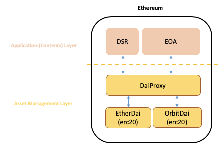
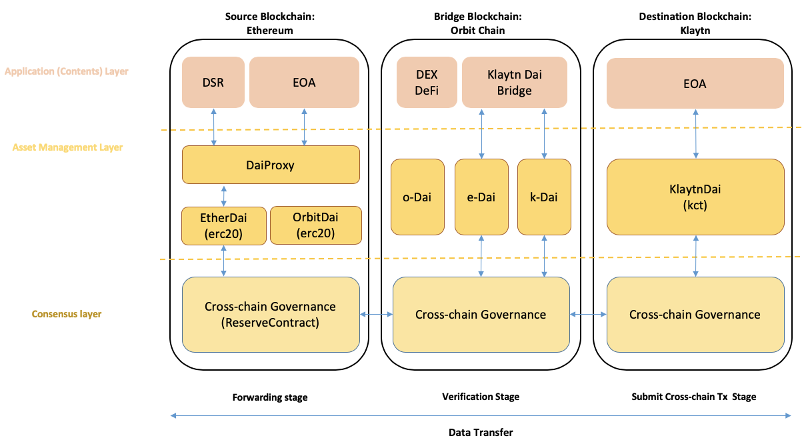
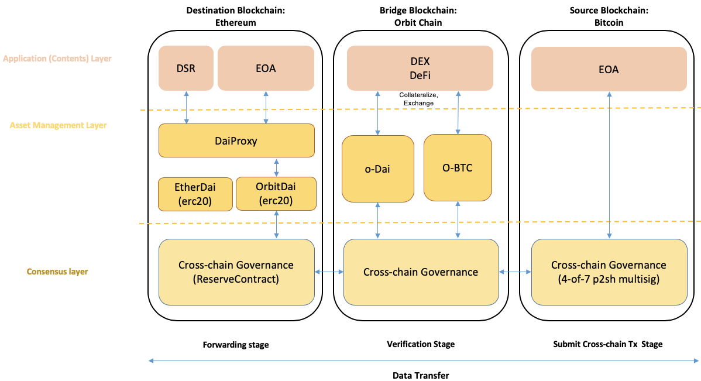
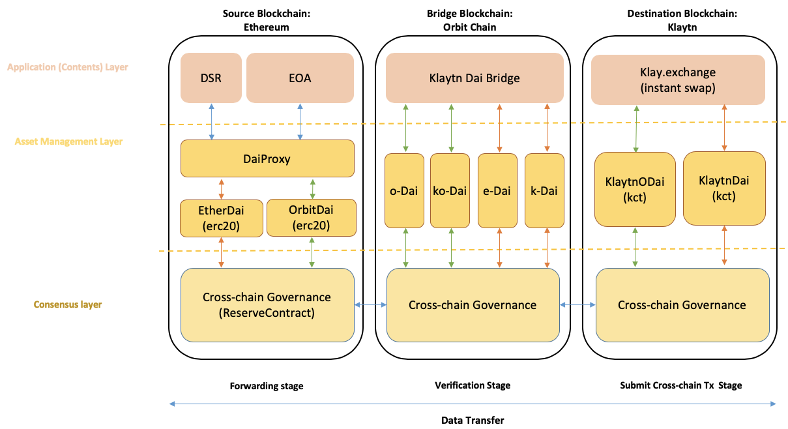

# Orbit Dai Project

- Orbit Chain is a Cross Chain platform which supports interoperability across blockchains including Bitcoin, Ethereum, Ripple, Klaytn, Terra, and more. With this technology, Orbit Chain provides various DeFi/DEX protocols including crypto lending and token swap protocol between incompatible chains.
- Orbit Dai Project works as a proxy for Dai on the Ethereum network to be used in the various protocols which integrates heterogeneous chains through Orbit Chain. Basically, all Dai(s) entering the Orbit Chain ecosystem will be deposited in DSR (Dai Saving Rate) and receiving reward from the DSR during they are utilized as various types of Dai based on the purpose of use cases by Orbit Dai Project.
- Users who wish to utilize Dai in the Orbit ecosystem would have two purposes.
    - First, achievement of liquidity while maintaining stability of a stable coin
    - Second, receiving additional benefits through the DSR while converting the stable coin.
- Orbit Dai is then processed into two different forms of ERC20 token, oDai and eDai, to meet each purposes mentioned above.
    - eDai is for the purpose of stability
    - oDai is for the purpose of DSR application
- Dai, used in issuing eDai, is also subject to DSR as well while it is in deposit. It means that oDai can receive higher returns than existing eDai because oDai even reflects the profits generated by eDai. This leads to the returns on oDai being higher, as the profits generated by eDai is diverted to the overall return of oDai.

# Deploy Process

1. Deploy `EtherDai`
2. Deploy `OrbitDai`
3. Deploy `DaiProxy`

    `constructor(address dai, address join, address pot, address vat, address eDai, address oDai)`

    - `dai` : Dai ERC20 contract address
        - [https://github.com/makerdao/dss/blob/master/src/dai.sol](https://github.com/makerdao/dss/blob/master/src/dai.sol)
    - `join` : DSR Join contract address
        - [https://github.com/makerdao/dss/blob/master/src/join.sol](https://github.com/makerdao/dss/blob/master/src/join.sol)
    - `pot` : DSR Pot contract address
        - [https://github.com/makerdao/dss/blob/master/src/pot.sol](https://github.com/makerdao/dss/blob/master/src/pot.sol)
    - `vat` : DSR Vat contract address
        - [https://github.com/makerdao/dss/blob/master/src/vat.sol](https://github.com/makerdao/dss/blob/master/src/vat.sol)
    - `eDai` : EtherDai ERC20 contract address
    - `oDai` : OrbitDai ERC20 contract address

4. `EtherDai.setProxy(DaiProxy)`
5. `OrbitDai.setProxy(DaiProxy)`
6. `DaiProxy.setReserve(reserve contract)`
    - A feature required for IBC connection of Orbit Chain
    - With this setting, ReserveContract, a function that manages IBC of Orbit Chain, can bring eDai and oDai without calling upon Approve function.

7. `DaiProxy.startProxy(0x0)`
    - This is required to start Proxy. Upon initial issuance, it executes as 0x0. Additionally, when deploying a new Proxy in the future, migration tasks such as transferring assets from the existing Proxy can be simplified by putting the existing Proxy address as a factor.

# System Description

### eDai

- ERC20 token of the mainnet
- 1 eDai has a value equivalent to 1 Dai.
- It is subject to receiving the DSR when issued, but the rewards will be distributed with oDai issuers.

### oDai

- ERC20 token of the mainnet
- 1 oDai has a value equivalent to 1 wad, and is also subject to receiving DSR.
    - wad is a unit that continues to increase in value by the DSR.

### kDai

- KCT (Klaytn Compatible Token) on Klaytn chain
- 1 kDai has a value equivalent to 1 Dai.

### DaiProxy

- Is in charge of Dai ↔ eDai ∙ oDai conversion on the mainnet.

### Dai → eDai

- The deposited Dai is placed into the DSR Pot.
- An eDai amount equivalent to the deposited Dai is issued.

### Dai → oDai

- The deposited Dai is placed into the DSR Pot.
- Dai is converted to wad, and an oDai amount equivalent to the deposited Dai is issued.

### eDai → Dai

- eDai held is converted into wad.
- The converted wad is then taken out of the Pot to be converted to Dai, then returned.

### oDai → Dai

- The basic premise is that wad should be zero if all amount of eDai and oDai are withdrawn from the ecosystem.
- The total issued amount of eDai is converted into wad.
    - If the total issued amount of eDai is kept the same level, the corresponding wad quantity will gradually decrease because the value of wad will continue to increase in value.
- All the remaining wads are reflected into oDai.
- After calculating the wad quantity users will receive based on a ratio, wad is converted to Dai to return it.

### oDai value per unit

- (Total wad in the Pot - wad occupied by eDai) / (total issued amount of oDai)
- oDai compensation rate
= (DSR x total value of the Pot - total value of eDai) / (total value of the Pot - total value of eDai)

### eDai ↔ Dai conversion rate

- 1 eDai = 1 Dai

### oDai ↔ Dai conversion rate

- total issued amount of oDai : oDai total value = (total issued amount of oDai) : (total value of the Pot - total value of eDai)
- 1 oDai = (total value of the Pot - total value of eDai) / (total issued amount of oDai) Dai
- The value of the oDai always rises.

# Use Case

### Trinito

- It is a Cross Chain DeFi service running on Orbit Chain.
- Trinito allows for Dai depositors to receive a higher reward rate than the actual DSR rate within the Dai ecosystem, as Trinito supports oDai lending.
- The oDai deposited in Trinito can also be used as collateral, meaning that the depositors are able to borrow assets of incompatible chains such as BTC, ETH, and XRP while receiving compensation.

### Klaytn Dai Bridge

- It is a protocol to transfer and convert the Ethereum-based Dai into the Klaytn blockchain.
- In utilizing Orbit Dai system, Orbit Dai’s eDai becomes locked up in the Orbit Chain. kDai is issued on the Klaytn through a Klaytn Network transmission thereafter.

# System Architecture

### Smart Contract

1. `DaiProxy` Contract
    - Source code : `DaiProxy.sol`
    - Deploy contract : `DaiProxy`
    - Main Function
        - Dai ↔ eDai
        - Dai ↔ oDai
        - Automated Dai saving / withdrawal to DSR when converting Dai.
2. `etherDai` Contract
    - Source code : `OrbitDai.sol`
    - Deploy contract : `EtherDai`  (extends WrappedDai)
    - Main Function
        - Mint/burn by implementation of DaiProxy
3. `orbitDai` Contract
    - source code : `OrbitDai.sol`
        - deploy contract : `OrbitDai` (extends WrappedDai)
        - Mint/burn by implementation of DaiProxy

# Extended System Architecture

### Klaytn Dai Bridge

### Cross Chain DEX/Defi

### Klaytn Dai Bridge (ultimate architecture)

- Final goal: For Dai holders within the Klaytn ecosystem to receive DSR rewards.
- Integrating with Klay.exchange built in Klaytn
    - It is a DEX supporting instant swap of Klaytn-based tokens.
    - https://klay.exchange
- Building a system for bridging both oDai and eDai into Klaytn through Klaytn Dai Bridge.
    - oDai in Ethereum corresponds to kDai on Klaytn at a 1:1 ratio.
    - eDai in Ethereum corresponds to koDai at a 1:1 ratio.
- Establishing an Instant Swap Pool (DEX) for koDai and kDai in order for kDai holders to swap kDai with koDai at any time to receive a reward rate and also be able to back to kDai for a stable state.

# License

Orbit DAI is released under the [MIT License](LICENSE).